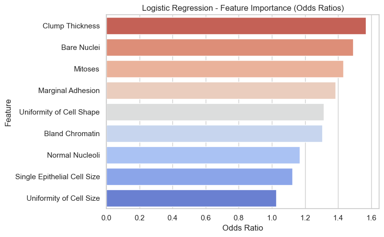

# Breast Tumor Classification

**Author:** Arezoo Jafari  
**Tools:** Python · scikit-learn · pandas · matplotlib · seaborn · Jupyter Notebook

---

## Overview

This project addresses a critical healthcare challenge:  
**Can we predict whether a breast tumor is benign or malignant based on cell characteristics — and do it in a way that is interpretable and clinically useful?**

Using the UCI Breast Cancer Wisconsin dataset, this notebook walks through a complete, end-to-end machine learning pipeline, focusing on both performance and **interpretability** — a key requirement in medical applications.

---

## 🔍 Problem Statement

Early and accurate detection of breast cancer is essential. While machine learning models can offer strong predictive performance, clinical decision-making requires more than just accuracy — **doctors need to understand the *why*** behind a prediction.

The main goal of this project was to:
- Build a reliable model that can distinguish between benign and malignant tumors
- Identify which features contribute most to the predictions
- Prioritize **interpretability and robustness** over black-box complexity

---

##  Dataset

The project uses the [UCI Breast Cancer Wisconsin (Original) Dataset](https://archive.ics.uci.edu/ml/datasets/breast+cancer+wisconsin+(original)), consisting of ~700 clinical samples. Each instance describes 10 features extracted from cell images (e.g., clump thickness, cell shape, bare nuclei), plus a target class (benign or malignant).

---

## Methodology

1. **Data Preprocessing**
   - Handled missing values in the `Bare Nuclei` feature using **class-wise median imputation**
   - Checked class balance (approx. 65% benign, 35% malignant)

2. **Exploratory Data Analysis**
   - Visualized distributions and class separation via boxplots
   - Used **Mutual Information** to quantify individual feature relevance
   - Identified high correlation between features (e.g., Cell Size and Cell Shape)

<table>
  <tr>
    <td width="50%">
      <h3>Mutual Information</h3>
      
    </td>
    <td width="50%">
      <h3>Variance Inflation Factor (VIF)</h3>
      <table>
        <tr><th>Feature</th><th>VIF</th></tr>
        <tr><td>Uniformity of Cell Size</td><td>7.189</td></tr>
        <tr><td>Uniformity of Cell Shape</td><td>6.512</td></tr>
        <tr><td>const</td><td>5.082</td></tr>
        <tr><td>Bland Chromatin</td><td>2.884</td></tr>
        <tr><td>Bare Nuclei</td><td>2.560</td></tr>
        <tr><td>Single Epithelial Cell Size</td><td>2.540</td></tr>
        <tr><td>Normal Nucleoli</td><td>2.440</td></tr>
        <tr><td>Marginal Adhesion</td><td>2.431</td></tr>
        <tr><td>Clump Thickness</td><td>1.920</td></tr>
        <tr><td>Mitoses</td><td>1.389</td></tr>
      </table>
    </td>
  </tr>
</table>

3. **Modeling**
   - Trained a **Logistic Regression** model with **L1 regularization** for built-in feature selection and interpretability
   - Performed **hyperparameter tuning** using grid search
   - Validated performance with **5-fold cross-validation**

4. **Evaluation Metrics**
   - **AUC:** 0.995  
   - **Precision:** 95%  
   - **Recall:** 98%  
   - **Accuracy:** ~96.8% (cross-validated)

5. **Feature Importance & Interpretation**
   - Identified top predictors using both **odds ratios** from the logistic regression model and **permutation importance**
 
  

  

   
   - Top predictors included: **Clump Thickness**, **Bare Nuclei**, and **Mitoses**, all of which had strong odds ratios and high permutation importance scores
   - One interesting discrepancy appeared with **Marginal Adhesion**:
     - Odds ratio suggested it was positively associated with malignancy (e.g., higher values increased cancer odds)
     - However, permutation importance showed it had little impact on model performance
   - To test this, I removed **Marginal Adhesion** and retrained the model:
     - **AUC improved slightly**, from **0.9951** to **0.9970**
     - This indicated that its predictive signal was likely already captured by stronger features like **Cell Shape**, **Clump Thickness**, and **Bare Nuclei**
---

## Key Takeaways

- **Data quality and context matter.**  
  Simple imputation choices — like using a class-wise median — can preserve meaningful patterns and reduce bias, especially when class distributions differ.

- **Feature relevance should be evaluated from multiple perspectives.**  
  Mutual Information helped assess individual feature–target relationships, while correlation analysis, VIF and L1 regularization addressed multicollinearity.

- **Model interpretability is not a trade-off — it is a strength.**  
  Logistic regression with L1 regularization not only delivered high accuracy but also enabled transparent evaluation of feature contributions, which is essential for trust in healthcare applications.

- **Not all statistically “important” features are operationally useful.**  
  Marginal Adhesion had a positive odds ratio, yet removing it improved model performance — highlighting the value of permutation importance for assessing true model dependency.

- **A robust model is one that generalizes well and is not overly reliant on weak or redundant signals.**  
  By streamlining features and validating across folds, the model achieved both reliability and interpretability, making it practical for real-world decision support systems.

